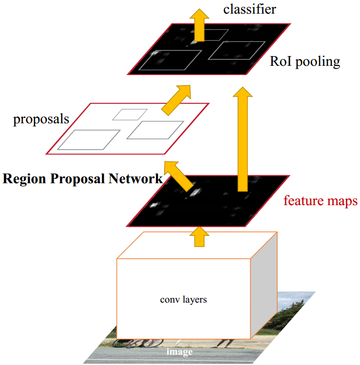
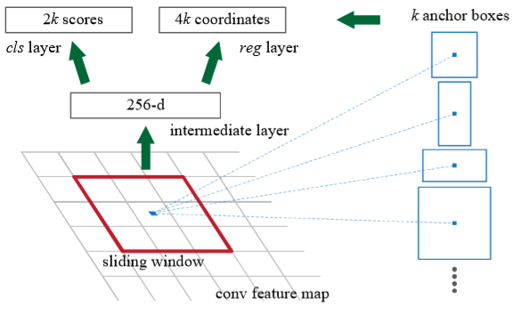

Welcome to the ModelArts-Lab wiki!
# Faster RCNN模型解析
   Faster RCNN是由Ross Girshick由何凯明等人在2016年将其用于目标检测任务中，能够完成高效的与传统的RCNN相比，利用RPN(Region Proposal Networks)完成候选框的选择，Fast RCNN的结构如下图所示：



如图，Faster R-CNN网络分为两部分，一是Region Proposal Network(RPN)，二是Fast R-CNN。其中RPN包括图中proposals和conv layers，Fast R-CNN包括卷积层、ROI pooling及后面全连接层等部分。卷积层是被RPN和Fast R-CNN两部分共享的。
Faster RCNN首先将整张图片输进CNN，提取图片的feature maps。将图片特征输入到到RPN，得到候选框的特征信息。RPN对于候选框中提取出的特征，使用分类器判别是否属于待识别的目标的候选框,将属于某一类别的候选框，用回归器进一步调整其位置。最后将目标框和图片的特征向量输入到Roi pooling层，再通过分类器进行Softmax分类，完成目标检测的任务。RPN能够协助Fast RNN将注意力集中在候选框中。
## 卷积层
Faster RCNN首先将整张图片输进CNN，提取图片的feature map，再将其输入到到RPN，得到候选框的特征信息。这里我们采用VGG16完成feature map的提取。VGG16的结构如下所示：

```
def nn_base(input_tensor=None, trainable=False):


    # Determine proper input shape
    if K.image_dim_ordering() == 'th':
        input_shape = (3, None, None)
    else:
        input_shape = (None, None, 3)

    if input_tensor is None:
        img_input = Input(shape=input_shape)
    else:
        if not K.is_keras_tensor(input_tensor):
            img_input = Input(tensor=input_tensor, shape=input_shape)
        else:
            img_input = input_tensor

    if K.image_dim_ordering() == 'tf':
        bn_axis = 3
    else:
        bn_axis = 1

    # Block 1
    x = Conv2D(64, (3, 3), activation='relu', padding='same', name='block1_conv1')(img_input)
    x = Conv2D(64, (3, 3), activation='relu', padding='same', name='block1_conv2')(x)
    x = MaxPooling2D((2, 2), strides=(2, 2), name='block1_pool')(x)

    # Block 2
    x = Conv2D(128, (3, 3), activation='relu', padding='same', name='block2_conv1')(x)
    x = Conv2D(128, (3, 3), activation='relu', padding='same', name='block2_conv2')(x)
    x = MaxPooling2D((2, 2), strides=(2, 2), name='block2_pool')(x)

    # Block 3
    x = Conv2D(256, (3, 3), activation='relu', padding='same', name='block3_conv1')(x)
    x = Conv2D(256, (3, 3), activation='relu', padding='same', name='block3_conv2')(x)
    x = Conv2D(256, (3, 3), activation='relu', padding='same', name='block3_conv3')(x)
    x = MaxPooling2D((2, 2), strides=(2, 2), name='block3_pool')(x)

    # Block 4
    x = Conv2D(512, (3, 3), activation='relu', padding='same', name='block4_conv1')(x)
    x = Conv2D(512, (3, 3), activation='relu', padding='same', name='block4_conv2')(x)
    x = Conv2D(512, (3, 3), activation='relu', padding='same', name='block4_conv3')(x)
    x = MaxPooling2D((2, 2), strides=(2, 2), name='block4_pool')(x)

    # Block 5
    x = Conv2D(512, (3, 3), activation='relu', padding='same', name='block5_conv1')(x)
    x = Conv2D(512, (3, 3), activation='relu', padding='same', name='block5_conv2')(x)
    x = Conv2D(512, (3, 3), activation='relu', padding='same', name='block5_conv3')(x)

    return x

```

## RPN
相比于Fast RCNN,Faster R-CNN引入RPN(Region Proposal Network)完成候选框的提取，使得算法效率得到进一步提升。   
RPN将任意尺寸大小的图片作为输入，输出若干个矩形候选框。为了生成区域候选框，在卷积层最后一层feature map上滑动一个(n\*n)的网络,将卷积生成的feature map与(n\*n)的窗口进行卷积运算。每一个滑动窗口都映射为一个更低维的特征。得到的特征送入两个分支中，一个用于框分类，另一个用于框回归。此网络执行滑动窗口形式，所有空间位置都共享全连接层。如下图所示：



滑动窗口的中心在图像上对应一片区域，计算出该区域的中心位置后以该位置为中心，按3种scale、每种scale各有3种长宽比取9个矩形区域。这些区域就是提取到的anchors boxes。可见，feature maps中的一个位置，共有9个anchors，3种scale可以根据具体情况更改的，更改时最好能使最大的scale能基本将input image覆盖。
在确定好k个anchor box之后，就能确定相应的位置信息，通过2次bounding-box regression对位置进行修正。
首先判断anchors是否为前景，使用softmax classifier对anchors进行二分类，输出两个概率值，即图中左侧对应的2k score。其次，计算对于anchors的bounding box regression偏移量(x,y,w,h)，以修正边框位置,即图中右侧4k coordinates。
最后将两者结合生成region proposals，同时剔除太小和超出边界的proposals，最后将提取到的proposals提交给后面的Roi Pooling层。
```
def rpn(base_layers, num_anchors):

    x = Conv2D(512, (3, 3), padding='same', activation='relu', kernel_initializer='normal', name='rpn_conv1')(base_layers)

    x_class = Conv2D(num_anchors, (1, 1), activation='sigmoid', kernel_initializer='uniform', name='rpn_out_class')(x)
    x_regr = Conv2D(num_anchors * 4, (1, 1), activation='linear', kernel_initializer='zero', name='rpn_out_regress')(x)

    return [x_class, x_regr, base_layers]
```
## Roi Pooling
Fast R-CNN改进了R-CNN,应用了Roi Pooling。
由于在全连接层，需要输入固定大小的特征向量，R-CNN网络经过warp操作统一成固定的大小再送入后续网络，导致图像的变形和扭曲。而且每一个proposal均需要单独进行特征提取，重复计算量大。Poipooling通过卷积计算将图像统一成固定大小的特征向量。Roi Pooling的输入是卷积层得到的feature map和RNP得到的anchor，将其分割成7 * 7大小的子窗口，对每个子窗口进行max-pooling操作，得到固定输出大小的feature map。而后进行后续的全连接层操作。
```
class RoiPoolingConv(Layer):
    '''ROI pooling layer for 2D inputs.
    See Spatial Pyramid Pooling in Deep Convolutional Networks for Visual Recognition,
    K. He, X. Zhang, S. Ren, J. Sun
    # Arguments
        pool_size: int
            Size of pooling region to use. pool_size = 7 will result in a 7x7 region.
        num_rois: number of regions of interest to be used
    # Input shape
        list of two 4D tensors [X_img,X_roi] with shape:
        X_img:
        `(1, channels, rows, cols)` if dim_ordering='th'
        or 4D tensor with shape:
        `(1, rows, cols, channels)` if dim_ordering='tf'.
        X_roi:
        `(1,num_rois,4)` list of rois, with ordering (x,y,w,h)
    # Output shape
        3D tensor with shape:
        `(1, num_rois, channels, pool_size, pool_size)`
    '''
    def __init__(self, pool_size, num_rois, **kwargs):

        self.dim_ordering = K.image_dim_ordering()
        assert self.dim_ordering in {'tf', 'th'}, 'dim_ordering must be in {tf, th}'

        self.pool_size = pool_size
        self.num_rois = num_rois

        super(RoiPoolingConv, self).__init__(**kwargs)

    def build(self, input_shape):
        if self.dim_ordering == 'th':
            self.nb_channels = input_shape[0][1]
        elif self.dim_ordering == 'tf':
            self.nb_channels = input_shape[0][3]

    def compute_output_shape(self, input_shape):
        if self.dim_ordering == 'th':
            return None, self.num_rois, self.nb_channels, self.pool_size, self.pool_size
        else:
            return None, self.num_rois, self.pool_size, self.pool_size, self.nb_channels

    def call(self, x, mask=None):

        assert(len(x) == 2)

        #特征图和原始图像上框的坐标
        img = x[0]
        rois = x[1]

        input_shape = K.shape(img)

        outputs = []

        for roi_idx in range(self.num_rois):

            x = rois[0, roi_idx, 0]
            y = rois[0, roi_idx, 1]
            w = rois[0, roi_idx, 2]
            h = rois[0, roi_idx, 3]

            row_length = w / float(self.pool_size)
            col_length = h / float(self.pool_size)

            num_pool_regions = self.pool_size

            #NOTE: the RoiPooling implementation differs between theano and tensorflow due to the lack of a resize op
            # in theano. The theano implementation is much less efficient and leads to long compile times
            
            if self.dim_ordering == 'th':
                for jy in range(num_pool_regions):
                    for ix in range(num_pool_regions):
                        x1 = x + ix * row_length
                        x2 = x1 + row_length
                        y1 = y + jy * col_length
                        y2 = y1 + col_length

                        x1 = K.cast(x1, 'int32')
                        x2 = K.cast(x2, 'int32')
                        y1 = K.cast(y1, 'int32')
                        y2 = K.cast(y2, 'int32')

                        x2 = x1 + K.maximum(1,x2-x1)
                        y2 = y1 + K.maximum(1,y2-y1)

                        new_shape = [input_shape[0], input_shape[1],
                                     y2 - y1, x2 - x1]

                        x_crop = img[:, :, y1:y2, x1:x2]
                        xm = K.reshape(x_crop, new_shape)
                        pooled_val = K.max(xm, axis=(2, 3))
                        outputs.append(pooled_val)

            elif self.dim_ordering == 'tf':
                x = K.cast(x, 'int32')
                y = K.cast(y, 'int32')
                w = K.cast(w, 'int32')
                h = K.cast(h, 'int32')
                
                rs = tf.image.resize_images(img[:, y:y+h, x:x+w, :], (self.pool_size, self.pool_size))
                 print("resize_images",img[:, y:y+h, x:x+w, :].shape)
                 print("resize_result",rs.shape)
                outputs.append(rs)

        final_output = K.concatenate(outputs, axis=0)
        final_output = K.reshape(final_output, (1, self.num_rois, self.pool_size, self.pool_size, self.nb_channels))

        if self.dim_ordering == 'th':
            final_output = K.permute_dimensions(final_output, (0, 1, 4, 2, 3))
        else:
            final_output = K.permute_dimensions(final_output, (0, 1, 2, 3, 4))

        return final_output
```

## Classifier
分类器完成对候选区域的检测。利用RoI feature maps计算R类别，同时再次bounding box regression获得检测框最终的位置。
```
def classifier(base_layers, input_rois, num_rois, nb_classes = 21, trainable=False):

    # compile times on theano tend to be very high, so we use smaller ROI pooling regions to workaround

    if K.backend() == 'tensorflow':
        pooling_regions = 7
        input_shape = (num_rois,7,7,512)
    elif K.backend() == 'theano':
        pooling_regions = 7
        input_shape = (num_rois,512,7,7)

    out_roi_pool = RoiPoolingConv(pooling_regions, num_rois)([base_layers, input_rois])

    out = TimeDistributed(Flatten(name='flatten'))(out_roi_pool)
    out = TimeDistributed(Dense(4096, activation='relu', name='fc1'))(out)
    out = TimeDistributed(Dropout(0.5))(out)
    out = TimeDistributed(Dense(4096, activation='relu', name='fc2'))(out)
    out = TimeDistributed(Dropout(0.5))(out)

    out_class = TimeDistributed(Dense(nb_classes, activation='softmax', kernel_initializer='zero'), name='dense_class_{}'.format(nb_classes))(out)
    # note: no regression target for bg class
    out_regr = TimeDistributed(Dense(4 * (nb_classes-1), activation='linear', kernel_initializer='zero'), name='dense_regress_{}'.format(nb_classes))(out)

    return [out_class, out_regr]
```
#后记

从原始的CNN增加候选框的提取过程形成RCNN。接下来，RCNN加入Roi pooling形成Fast RCNN。然后，Faster RNN引入了RPN完成候选框的提取，并与FRCNN共享卷积层。模型不断的改善，弥补之前的不足，使得目标检测任务更准确和迅速。

