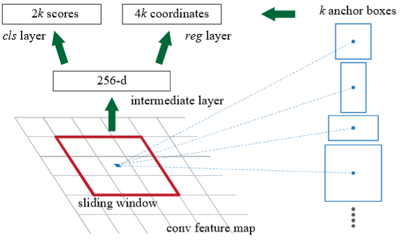

Welcome to the ModelArts-Lab wiki!
# Faster RCNN模型解析
   Faster RCNN是由Ross Girshick由何凯明等人在2016年将其用于目标检测任务中，能够完成高效的与传统的RCNN相比，利用RPN(Region Proposal Networks)完成候选框的选择，Fast RCNN的结构如下图所示：

如图，Faster R-CNN网络分为两部分，一是Region Proposal Network(RPN)，二是Fast R-CNN。其中RPN包括图中proposals和conv layers，Fast R-CNN包括卷积层、ROI pooling及后面全连接层等部分。卷积层是被RPN和Fast R-CNN两部分共享的。
Faster RCNN首先将整张图片输进CNN，提取图片的feature maps。将图片特征输入到到RPN，得到候选框的特征信息。RPN对于候选框中提取出的特征，使用分类器判别是否属于待识别的目标的候选框,将属于某一类别的候选框，用回归器进一步调整其位置。最后将目标框和图片的特征向量输入到Roi pooling层，再通过分类器进行Softmax分类，完成目标检测的任务。RPN能够协助Fast RNN将注意力集中在候选框中。
## 卷积层
Faster RCNN首先将整张图片输进CNN，提取图片的feature map，再将其输入到到RPN，得到候选框的特征信息。这里我们采用VGG16完成feature map的提取。VGG16的结构如下所示：

## RPN
相比于Fast RCNN,Faster R-CNN引入RPN(Region Proposal Network)完成候选框的提取，使得算法效率得到进一步提升。   
RPN将任意尺寸大小的图片作为输入，输出若干个矩形候选框。为了生成区域候选框，在卷积层最后一层feature map上滑动一个(n\*n)的网络,将卷积生成的feature map与(n\*n)的窗口进行卷积运算。每一个滑动窗口都映射为一个更低维的特征。得到的特征送入两个分支中，一个用于框分类，另一个用于框回归。此网络执行滑动窗口形式，所有空间位置都共享全连接层。如下图所示：

滑动窗口的中心在图像上对应一片区域，计算出该区域的中心位置后以该位置为中心，按3种scale、每种scale各有3种长宽比取9个矩形区域。这些区域就是提取到的anchors boxes。可见，feature maps中的一个位置，共有9个anchors，3种scale可以根据具体情况更改的，更改时最好能使最大的scale能基本将input image覆盖。
在确定好k个anchor box之后，就能确定相应的位置信息，通过2次bounding-box regression对位置进行修正。
首先判断anchors是否为前景，使用softmax classifier对anchors进行二分类，输出两个概率值，即图中左侧对应的2k score。其次，计算对于anchors的bounding box regression偏移量(x,y,w,h)，以修正边框位置,即图中右侧4k coordinates。
最后将两者结合生成region proposals，同时剔除太小和超出边界的proposals，最后将提取到的proposals提交给后面的Roi Pooling层。

## Roi Pooling
Fast R-CNN改进了R-CNN,应用了Roi Pooling。
由于在全连接层，需要输入固定大小的特征向量，R-CNN网络经过warp操作统一成固定的大小再送入后续网络，导致图像的变形和扭曲。而且每一个proposal均需要单独进行特征提取，重复计算量大。Poipooling通过卷积计算将图像统一成固定大小的特征向量。Roi Pooling的输入是卷积层得到的feature map和RNP得到的anchor，将其分割成7 * 7大小的子窗口，对每个子窗口进行max-pooling操作，得到固定输出大小的feature map。而后进行后续的全连接层操作。

## Classifier
分类器完成对候选区域的检测。利用RoI feature maps计算R类别，同时再次bounding box regression获得检测框最终的位置。

# 后记

从原始的CNN增加候选框的提取过程形成RCNN。接下来，RCNN加入Roi pooling形成Fast RCNN。然后，Faster RNN引入了RPN完成候选框的提取，并与FRCNN共享卷积层。模型不断的改善，弥补之前的不足，使得目标检测任务更准确和迅速。

