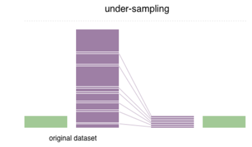
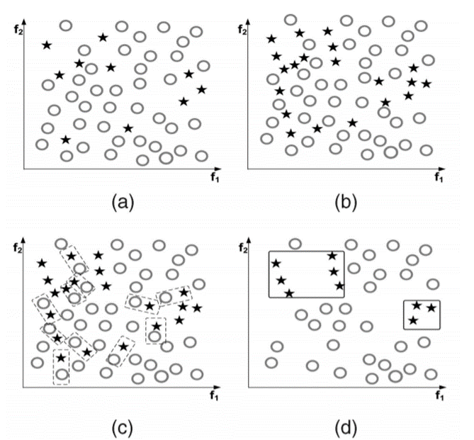

# 数据不均衡的处理方法
## Sampling Methods 
### 过采样：
向小样本中添加数据，可通过复制小样本数据等，使得小样本和大样本数目相等
对于图像方法：通过旋转，扭曲既可以对数据进行增强，又可以改变样本的数量。

### 欠采样：
从大样本中减掉数据，使得小样本和大样本数目相等。

### 过采样与欠采样结合：
同时进行过采样与欠采样，使数据均衡
[Github案例]( https://github.com/ufoym/imbalanced-dataset-sampler)

## Informed Undersampling
### EasyEnsemble
通过多次欠采样产生多个不同的训练集，进而训练多个不同的分类器，通过组合多个分类器的结果得到最终的结果.其伪代码如下图所示：

根据伪代码，我们可以得到如下示意图：

每次训练集采用大样本中的一部分数据和小样本共同进行训练，生成一个分类器。多次采样进行训练后得到一个分类器系统。对于测试数据，根据分类器系统的结果对其进行分类。
### BalanceCascade
先通过一次欠采样产生训练集，训练一个分类器，对于那些分类正确的大样本不放回，然后对这个更小的小样本欠采样产生训练集，训练第二个分类器，以此类推，最终组合所有分类器的结果得到最终结果。

根据伪代码得到如下的示意图：

## 数据生成的合成抽样方法
除了通过采样方式的不同，使数据达到平衡，除此之外
### SMOTE
SMOTE 算法是利用特征空间中现存少数类样本之间的相似性来建立人工数据的

小样本$x_i$从他属于小样本的k个近邻中随机选取一个数据，并生成一个新的数据，如图中菱形所示,将其作为小样本的新数据。
### Borderline-SMOTE
对靠近边界的minority样本创造新数据。

图中样本6和赝本7分布在大样本周围，它们和其他样本生成的小样本1和2离多数类样本最近，这就导致它们有可能被划分成多数类样本。因此，SMOTE算法的样本生成机制存在着一定盲目性。

只有最近邻样本集中大样本数据多于小样本数据的那些$x_i$才会被选中形成 “危险集 (DANGER)”。因此，DANGER 集中的样本代表少数类样本的边界（最容易被错分的样本）。然后对 DANGER 集使用 SMOTE 算法来在边界附近产生人工合成少数类样本。
## 利用数据清洗技术的抽样
### Tomek links
找出最近距离的2个样本（这2个样本属于不同的类），然后将这2个样本都去除，直到某一样本周围的近邻都是属于同一类。

## 代价敏感方法
采样方法主要考虑正负例的分布，而代价敏感方法主要考虑误分类样本的代价，通过代价矩阵来度量。

代价敏感性可以用在决策树上，也可以用在神经网络上，在神经网络上的应用主要有4个方面：
（1）代价敏感变更可以应用到概率评估上
（2）神经网络的输出也可以是代价敏感的
（3）代价敏感变更适用于学习参数
（4）最小误差函数可以用来预期代价。
难点：
   设置合理的权重，需要具体问题具体分析

针对不同的数据类型和分类